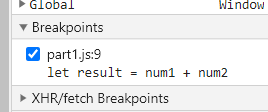
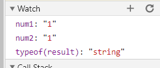
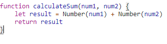

# DevTools - Debugging
>Breakpoint

>Watch Expressions

>What was the bug?

The values `num1` and `num2` were passed in as strings from the input boxes, but they weren't converted to integers when the sum was calculated. Therefore, `calculateSum` concatenated the two variables instead of adding them as integers.

> How would you fix it?

I would convert `num1` and `num2` to numbers ( using `Number()` ) within the `calculateSum` function - this way, the function is more adaptable in case the same mistake is made again.

# DevTools - Networking Tab
1. What is the name of the new json file?
  
>citylogs.json

2. Which file initiated the download of the new file?
   
>part2.js

3. What is its file size?
   
>11.7mb

4. How long did it take to download?
   
>17.97 seconds

5. What was your User-Agent for the browser that made the request?

>Mozilla/5.0 (Windows NT 10.0; Win64; x64) AppleWebKit/537.36 (KHTML, like Gecko) Chrome/88.0.4324.104 Safari/537.36

6. In the response, what type of server did it come from?

>Apache

7. When was the file last modified?

>Tue, 26 Jan 2021 22:14:13 GMT

8. What was the Content-Type of the file?

>application/json

9. Which method inside the initiating file made the request?

>`part2.js`